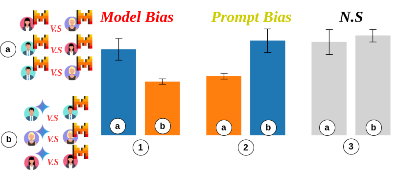

# Does Your Definition Matter?

**LLM Interaction Comparison Between Prompt Sensitivity and Internal Behavior for Social Media Analysis**

---

## Experimental Overview



**Description:**
We compare two types of pairwise agreement for *N* participants and 2 LLMs:

1. **Prompt-wise agreement:** Agreement across multiple user prompts using the same LLM.
2. **Model-wise agreement:** Agreement across multiple LLMs using the same user prompt.

**Interpretation:**

* **Prompt-wise > Model-wise** → model bias dominates
* **Model-wise > Prompt-wise** → prompt bias dominates
* **Prompt-wise ≈ Model-wise** → both model and prompt contribute comparably

*Prompt sensitivity* is measured as the standard deviation of prompt-wise agreement.

---

## Setup

1. Install dependencies:

```bash
pip install -r requirements.txt
```

2. LLM inference: [vLLM documentation](https://docs.vllm.ai/en/latest/)

---

## Data

| File / Folder       | Description                     |
| ------------------- | ------------------------------- |
| `hotels.tsv`        | Hotel reviews dataset           |
| `form.tsv`          | Extracted Google Form responses |
| `id_to_remove.json` | IDs of uninformative reviews    |
| `prompt/`           | Directory with prompt template  |
| `semeval/`          | Santity check ground-truth dataset  |

---

## Re-running Classification

1. Generate batches:

```bash
python task_build_batch.py
```

This produces `batch.tsv`.

2. Run classification (SLURM):

./launch_script.sh

Executes `task_run.py` using `batch.tsv` as input.

---

## Compute Agreement

1. Format outputs:

```
python task_output_format.py
```

2. Compute agreement metrics (e.g., MCC):

```
python task_compute_x_.py
```

---

## Figures

All notebooks for figure generation are in the `graph/` folder.
